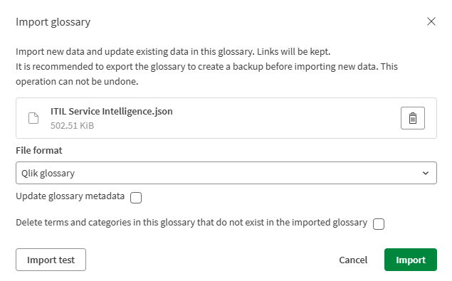

# ITIL 5 Service Intelligence Accelerator — Applications

Three Qlik Sense applications that together make up the accelerator's data pipeline: raw data comes in, gets conformed into a common ITIL data model, and lands in a ready-to-use Service Intelligence app.

| # | App | What it does |
|---|---|---|
| 1 | **Load Data** | Pulls raw data from ServiceNow and writes it out as Raw QVDs. |
| 2 | **Conform Data** | Reads the Raw QVDs, translates them into the ITIL 5 common data model, adds the master calendar, and writes out Conform QVDs. |
| 3 | **Service Intelligence** | Reads the Conform QVDs and powers the actual dashboards — includes the visualization theme and the ITIL extensions out of the box. |
| 4 | **Pipeline Pulse** | Reads the metadata QVDs and visualizes the freshness of the pipeline |

Each app hands off to the next purely through QVDs on disk — there's no live connection between the three apps themselves.

---

## 1. Upload the Applications

All three `.qvf` files need to be uploaded as new applications on your target platform. The exact steps depend on where you're deploying.

### Qlik Cloud

1. In the hub, go to the space you want these apps to live in.
2. Click **Add new** → **App**, then choose **Upload from file** (or drag-and-drop the `.qvf` directly onto the space).
3. Repeat for all three `.qvf` files: **Load Data**, **Conform Data**, and **Service Intelligence**.

### Qlik Sense Enterprise on Windows (QSEoW)

1. In the QMC, go to **Apps** → **Import**.
2. Browse to each `.qvf` file and import it — repeat for all three.
3. Assign the apps to the appropriate stream and set permissions as needed for your environment.

Either way, get all three apps uploaded before trying to run anything — Conform Data will fail to find its source QVDs if Load Data hasn't run at least once, and the same goes for Service Intelligence depending on Conform Data.

## 2. Create and Import the Business Glossary

This suite ships with a prebuilt Business Glossary (`ITIL Service Intelligence.json`) covering the terms used across all three apps. You'll need to create a new glossary and import this file into it — it won't attach itself automatically.

1. In Qlik Cloud, go to **Glossaries** and click **Create glossary** (give it a name, e.g. "ITIL Service Intelligence").
2. Open the new glossary and choose **Import glossary**.
3. Select the included `ITIL Service Intelligence.json` file, leave the format as **Qlik glossary**, and click **Import**.

That's it — the terms, categories, and their links will populate into your new glossary.

## 3. Configure Each App

Each of the three apps has its own **Configuration** section (typically a set of script variables near the top of the load script) where you'll set things like your ServiceNow instance URL, connection names, and any date ranges specific to your environment. Go into each app's load script editor and work through its Configuration section before reloading — without that, the apps won't know where to pull your data from.

---

Once all three apps are uploaded, the glossary is imported, and each app's Configuration section is filled in, run the apps in order — **Load Data → Conform Data → Service Intelligence** — and you should have a working pipeline end to end.
