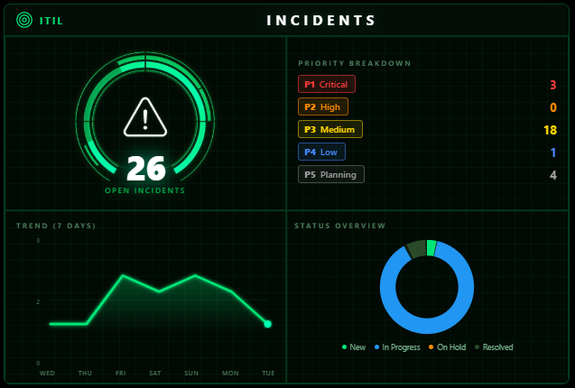
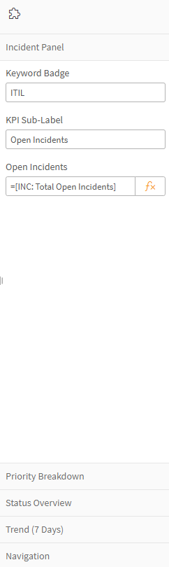

# ITIL Incidents

A dark "mission control" style Qlik Sense visualization extension for tracking incident management KPIs — open incident volume, a priority breakdown, a status donut, and a 7-day trend sparkline, all in one tile.



---

## 1. Install the Extension

Before this shows up in Custom Objects, someone with the right permissions needs to install it. It won't just materialize because you willed it into existence hard enough. This extension doesn't rely on anything Cloud-specific, so it works fine on either platform — the install mechanics just differ.

### Qlik Cloud

1. Go to **Management Console → Extensions**.
2. Click **Add extension** and upload the `ITILIncidents_v{version}.zip` file — don't unzip it first, Qlik wants the whole package.
3. Once uploaded, it's available to any app on that tenant/space that has permission to use it.

If you're not a tenant admin, ping whoever manages your Qlik Cloud environment and hand them the zip.

### Qlik Sense Enterprise on Windows (QSEoW)

1. Open the **Qlik Management Console (QMC)** and go to **Extensions**.
2. Click **Import**, browse to `ITILIncidents_v{version}.zip`, and upload — again, keep it zipped.
3. The extension will land in the shared extensions folder on the server (typically something like `C:\ProgramData\Qlik\Sense\CustomData\extensions\`) and become available across the site once the import completes.
4. If it doesn't show up right away in Custom Objects on an already-open app, a hub/browser refresh usually does the trick.

Either way, you'll need QMC/admin access to get it in the door — after that, it behaves identically regardless of platform.

## 2. Add It to a Sheet

If you're not working in the app it was originally built for (the ITIL Service Intelligence app), here's how to drop it onto any sheet:

1. Open the app and go into **Edit mode** on the sheet you want.
2. On the left-hand asset panel, open **Custom objects**.
3. Find **ITIL Incidents** in the list and drag it onto the sheet canvas like any other chart object.
4. Resize/reposition as needed — the layout is responsive but plays nicest in a roughly square-ish tile (it was designed as a quadrant: gauge, priority list, trend chart, status donut).

That's it — no scripting required to place it. The heavy lifting happens in the Properties panel.

## 3. Configure the Properties

This is the part that actually makes it *your* data instead of a pretty green shell. Most fields in the property panel take an **expression** — meaning you can either:
- Type a raw expression directly (e.g. `Count([Incident])`), or
- Click the little **fx** icon next to the field to open the expression editor and pick a master measure/dimension, build set analysis, etc.

A couple of fields are plain text instead of expressions — those are called out below.



The panel is organized into a few sections:

### Incident Panel (top-level)
| Field | What it does |
|---|---|
| **Keyword Badge** | Small badge text in the top-left corner (defaults to `ITIL`). Plain text, not an expression. |
| **KPI Sub-Label** | The label under the big center number — e.g. *"Open Incidents"*. Plain text. |
| **Open Incidents** | The expression driving the big number itself. This is where you'd plug in a master measure like `[INC: Total Open Incidents]`, or write your own. |

### Priority Breakdown
Five labeled expression slots — one per priority tier (P1 Critical through P5 Planning in the screenshot). Wire each one to a count filtered by your priority field, e.g.:
```
Count({<[Priority]={'1 - Critical'}>} [Incident])
```
The P1–P5 badge colors are fixed (red/orange/yellow/blue/grey) to match standard ITIL priority conventions — you're only supplying the numbers.

### Status Overview
Feeds the donut chart's status segments (New / In Progress / On Hold / Resolved in the screenshot). Each status is its own expression slot, same pattern as Priority Breakdown — count filtered by your status field.

### Trend (7 Days)
This section is a little different from the others:
- **Date Field Name** is a **plain text field name** (e.g. `Opened Date`, no brackets) — not an expression. The extension needs the raw field name to build its own internal hypercube for the sparkline.
- **Trend Measure** is an expression — point it at a count measure like `[INC: Total Open Incidents]`.
- There's also a toggle for showing/hiding the data point values along the trend line.

If the sparkline shows flat zeros or looks off, double check the date field name is spelled exactly as it appears in your data model (not a master dimension name).

### Navigation
Optional — lets you set a target sheet ID so the **Details** button in the header jumps somewhere else in the app.

---

## Notes

- If you upgrade to a newer version of the extension and the properties look wrong or fields go blank, **delete the tile and drag a fresh one from Custom Objects** rather than re-importing the zip onto an existing tile. Qlik caches the old property schema on existing objects, and re-importing won't refresh it.
- All expression fields work the same as any native Qlik chart — master measures, ad-hoc formulas, and set analysis are all fair game. The Trend date field is the one exception (plain text, see above).
