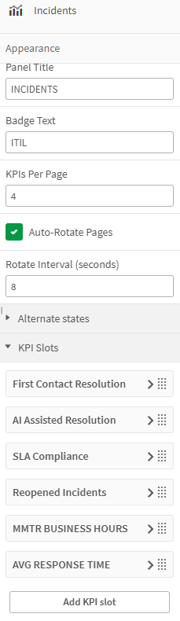

# ITIL KPI Array

A dark "mission control" style Qlik Sense visualization extension that displays a paged, auto-rotating carousel of KPI cards — each with an overall value, a current-vs-previous comparison, and an automatically calculated variance. Unlike the other three ITIL extensions (Incidents, Problems, Changes), this one isn't locked to a single practice area — the panel title and badge are just text fields, so you can stand up a KPI Array for Incidents, Changes, Problems, or anything else you want to throw metrics at.

See it in action: `assets/Changes_KPI_Array_Final.mp4`

---

## 1. Install the Extension

Before this shows up in Custom Objects, someone with the right permissions needs to install it. It won't just materialize because you willed it into existence hard enough. This extension doesn't rely on anything Cloud-specific, so it works fine on either platform — the install mechanics just differ.

### Qlik Cloud

1. Go to **Management Console → Extensions**.
2. Click **Add extension** and upload the `ITILKPIArray_v{version}.zip` file — don't unzip it first, Qlik wants the whole package.
3. Once uploaded, it's available to any app on that tenant/space that has permission to use it.

If you're not a tenant admin, ping whoever manages your Qlik Cloud environment and hand them the zip.

### Qlik Sense Enterprise on Windows (QSEoW)

1. Open the **Qlik Management Console (QMC)** and go to **Extensions**.
2. Click **Import**, browse to `ITILKPIArray_v{version}.zip`, and upload — again, keep it zipped.
3. The extension will land in the shared extensions folder on the server (typically something like `C:\ProgramData\Qlik\Sense\CustomData\extensions\`) and become available across the site once the import completes.
4. If it doesn't show up right away in Custom Objects on an already-open app, a hub/browser refresh usually does the trick.

Either way, you'll need QMC/admin access to get it in the door — after that, it behaves identically regardless of platform.

## 2. Add It to a Sheet

If you're not working in the app it was originally built for, here's how to drop it onto any sheet:

1. Open the app and go into **Edit mode** on the sheet you want.
2. On the left-hand asset panel, open **Custom objects**.
3. Find **ITIL KPI Array** in the list and drag it onto the sheet canvas like any other chart object.
4. Resize/reposition as needed — since it's a paged carousel, it works well as either a compact sidebar strip or a wide banner, depending on how many KPIs per page you configure.

That's it — no scripting required to place it. The heavy lifting happens in the Properties panel.

## 3. Configure the Properties

### Appearance

| Field | What it does |
|---|---|
| **Panel Title** | The header text at the top of the card (e.g. `INCIDENTS`, `CHANGES`). Plain text. |
| **Badge Text** | The small badge next to the title (defaults to `ITIL`). Plain text. |
| **KPIs Per Page** | How many KPI slots are visible at once. If you've got more slots than this number, the extension pages through them. |
| **Auto-Rotate Pages** | Toggle on to have the extension automatically advance through pages on its own, no clicking required — good for a wall-mounted dashboard or a TV in the NOC. |
| **Rotate Interval (seconds)** | How long each page stays on screen before auto-advancing to the next one. Only matters if Auto-Rotate is turned on. |

### KPI Slots

This is where the extension earns its name — click **Add KPI slot** and you get a new, fully independent KPI card. There's no hard ceiling on how many you can add; stack up as many as you need (First Contact Resolution, AI Assisted Resolution, SLA Compliance, Reopened Incidents, MTTR, Avg Response Time — whatever your practice area cares about). Each slot has a drag handle so you can reorder them without deleting and rebuilding.

Every KPI slot asks for the same three expressions:

| Field | What it does |
|---|---|
| **Overall** | The lifetime/no-date-filter total for that metric — the big-picture number with no period comparison baked in. |
| **Current** | Whatever "current period" means to you. This is entirely your call — Current Month to Date, Current Week, Current Completed Month, Current Quarter, whatever fits the metric. Just write the set analysis expression for that period. |
| **Previous** | The matching prior period for whatever you picked as Current — e.g. if Current is MTD, Previous should be Prior MTD (same day-of-month cutoff), not just "last calendar month." The extension doesn't enforce a pairing for you; it's on you to make Current and Previous apples-to-apples. |

**Variance is calculated automatically** — you don't configure it. The extension takes Current and Previous and derives the variance (and its direction/color) on its own once those two expressions are in place.

This period flexibility is intentional: it means the same extension can show "Current Week vs Previous Week" for one KPI and "Current Completed Month vs Prior Completed Month" for another, side by side in the same array, because each slot's Current/Previous pairing is defined independently.

### Alternate States
Optional, collapsed by default — lets you bind the KPI array to an alternate state if your app uses them. Standard Qlik alternate-state behavior applies.

---

## Notes

- If you upgrade to a newer version of the extension and the properties look wrong or fields go blank, **delete the tile and drag a fresh one from Custom Objects** rather than re-importing the zip onto an existing tile. Qlik caches the old property schema on existing objects, and re-importing won't refresh it.
- Since Current/Previous are just expressions you write, mismatched period pairings (e.g. Current = MTD but Previous = full prior month) will still calculate a variance — it just won't mean what you think it means. Garbage in, confidently-displayed garbage out.
