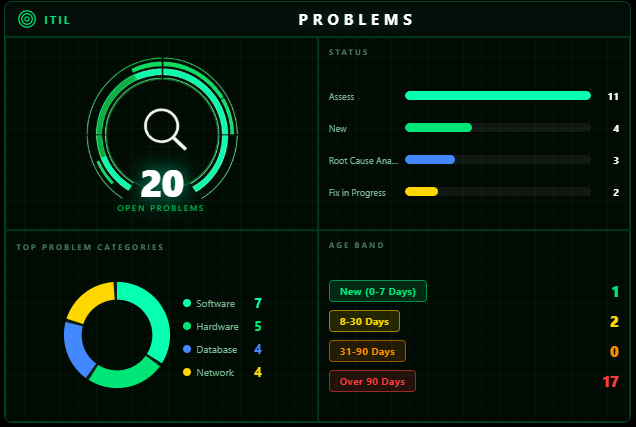
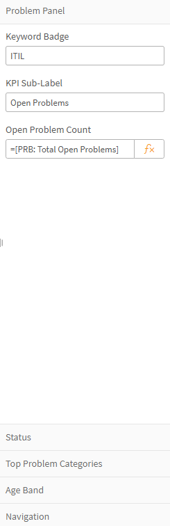

# ITIL Problems

A dark "mission control" style Qlik Sense visualization extension for tracking problem management KPIs — open problem volume, a status breakdown, top problem categories, and a clickable age band grid, all in one tile.



---

## 1. Install the Extension

Before this shows up in Custom Objects, someone with the right permissions needs to install it. It won't just materialize because you willed it into existence hard enough. This extension doesn't rely on anything Cloud-specific, so it works fine on either platform — the install mechanics just differ.

### Qlik Cloud

1. Go to **Management Console → Extensions**.
2. Click **Add extension** and upload the `ITILProblems_v{version}.zip` file — don't unzip it first, Qlik wants the whole package.
3. Once uploaded, it's available to any app on that tenant/space that has permission to use it.

If you're not a tenant admin, ping whoever manages your Qlik Cloud environment and hand them the zip.

### Qlik Sense Enterprise on Windows (QSEoW)

1. Open the **Qlik Management Console (QMC)** and go to **Extensions**.
2. Click **Import**, browse to `ITILProblems_v{version}.zip`, and upload — again, keep it zipped.
3. The extension will land in the shared extensions folder on the server (typically something like `C:\ProgramData\Qlik\Sense\CustomData\extensions\`) and become available across the site once the import completes.
4. If it doesn't show up right away in Custom Objects on an already-open app, a hub/browser refresh usually does the trick.

Either way, you'll need QMC/admin access to get it in the door — after that, it behaves identically regardless of platform.

## 2. Add It to a Sheet

If you're not working in the app it was originally built for (the ITIL Service Intelligence app), here's how to drop it onto any sheet:

1. Open the app and go into **Edit mode** on the sheet you want.
2. On the left-hand asset panel, open **Custom objects**.
3. Find **ITIL Problems** in the list and drag it onto the sheet canvas like any other chart object.
4. Resize/reposition as needed — the layout is responsive but plays nicest in a roughly square-ish tile (it was designed as a quadrant: gauge, status bars, category donut, age band grid).

That's it — no scripting required to place it. The heavy lifting happens in the Properties panel.

## 3. Configure the Properties

This is the part that actually makes it *your* data instead of a pretty green shell. Every field in the property panel takes an **expression** — meaning you can either:
- Type a raw expression directly (e.g. `Count([Problem])`), or
- Click the little **fx** icon next to the field to open the expression editor and pick a master measure/dimension, build set analysis, etc.



The panel is organized into a few sections:

### Problem Panel (top-level)
| Field | What it does |
|---|---|
| **Keyword Badge** | Small badge text in the top-left corner (defaults to `ITIL`). Plain text, not an expression. |
| **KPI Sub-Label** | The label under the big center number — e.g. *"Open Problems"*. Plain text. |
| **Open Problem Count** | The expression driving the big number itself. This is where you'd plug in a master measure like `[PRB: Total Open Problems]`, or write your own. |

### Status
Drives the horizontal status bars (Assess / New / Root Cause Analysis / Fix in Progress in the screenshot). Each row is its own expression slot — wire each one to a count filtered by your problem status field, e.g.:
```
Count({<[Status]={'Assess'}>} [Problem])
```
Bar length scales relative to the largest value automatically — you're only supplying the counts.

### Top Problem Categories
Feeds the donut chart's category segments (Software / Hardware / Database / Network in the screenshot). Each category is its own expression slot, same pattern as Status — count filtered by your category field.

### Age Band
Four fixed expression slots for problem aging buckets (New 0-7 Days, 8-30 Days, 31-90 Days, Over 90 Days in the screenshot). Wire each to a count filtered by how long the problem has been open, e.g.:
```
Count({<[Days Open]={">90"}>} [Problem])
```
This grid supports **click-to-select** — clicking a band in the live visualization applies a selection back to the app, so it doubles as a filter, not just a display.

### Navigation
Optional — lets you set a target sheet ID so the **Details** button in the header jumps somewhere else in the app.

---

## Notes

- If you upgrade to a newer version of the extension and the properties look wrong or fields go blank, **delete the tile and drag a fresh one from Custom Objects** rather than re-importing the zip onto an existing tile. Qlik caches the old property schema on existing objects, and re-importing won't refresh it.
- All expression fields work the same as any native Qlik chart — master measures, ad-hoc formulas, and set analysis are all fair game.
