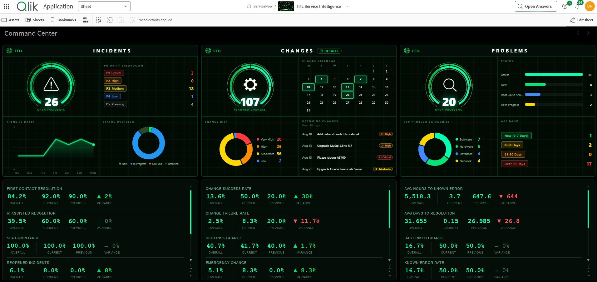

# ITIL 5 Service Intelligence Accelerator — Extensions

Four custom Qlik Sense visualization extensions plus a matching theme, all sharing the same dark "mission control" aesthetic. Together they give the Service Intelligence app its KPI panels, its color scheme, and the little bits of interactivity (click-to-filter, auto-rotating pages) that make the dashboards feel less like static charts.

## What's in here

| Extension | What it does |
|---|---|
| **[ITIL Incidents](./ITILIncidents)** | Open incident count, priority breakdown, status donut, and a 7-day trend sparkline. |
| **[ITIL Changes](./ITILChanges)** | Planned change count, a mini change calendar, a risk breakdown donut, and an upcoming-changes ticker. |
| **[ITIL Problems](./ITILProblems)** | Open problem count, status bars, top problem categories, and a clickable age-band grid. |
| **[ITIL KPI Array](./ITILKPIArray)** | A reusable, paged carousel of KPI cards — add as many as you want, each with an Overall/Current/Previous comparison and an auto-calculated variance. Not tied to any one practice area. |
| **[ITIL Command Center Theme](./ITIL-Command-Center-Theme)** | The dark green theme shown above. Not an extension — applies the color scheme app-wide to native Qlik objects. |

## How to use these

Each of the five links above goes to its own folder containing the extension (or theme) package and its assets. **Download whichever ones you want** — they don't have to be used together, though they're designed to look right at home if you use all of them.

**Installation directions live inside each folder's own README** — Qlik Cloud and QSEoW steps differ slightly, so check the specific README for the one you're installing rather than assuming they're identical across all five.

If you're setting up the full ITIL 5 Service Intelligence app as intended, you'll want all four extensions plus the theme. If you're just borrowing a piece (say, the KPI Array) for an unrelated app, that's fine too — just be aware the KPI Array in particular is genuinely general-purpose and not ITIL-specific under the hood.
